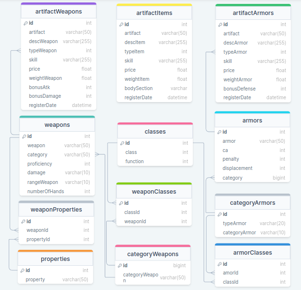

# Chronicles of Artifacts - Gerenciamento de Banco de Dados de RPG

Seja bem-vindo ao Chronicles of Artifacts, uma aplicação Java poderosa que permite administrar um mundo de aventuras e equipamentos para jogos de RPG. Este projeto oferece uma solução abrangente para gerenciar classes de personagens, armas, armaduras e muito mais. Ele foi criado para demonstrar minhas habilidades em desenvolvimento de software e modelagem de banco de dados.

## Características Destacadas

- **Classes de Personagens:** Explore uma ampla variedade de classes, desde guerreiros destemidos até feiticeiros misteriosos. Cada classe possui sua função única no mundo do RPG.
- **Armas e Armaduras:** Equipe seus personagens com uma vasta seleção de armas e armaduras. Crie combinações personalizadas para otimizar o estilo de luta de cada personagem.
- **Propriedades de Armas:** Personalize suas armas com propriedades únicas, como alcance estendido, versatilidade e mais, para criar estratégias de combate diversificadas.
- **Artefatos Mágicos:** Descubra armas e armaduras lendárias com habilidades especiais. Esses artefatos podem mudar o curso das batalhas e adicionar um toque épico à sua jornada.

## Como Utilizar

1. **Configuração:** Clone este repositório e configure o banco de dados de acordo com as instruções no arquivo `README.md`.
2. **Exploração:** Use a aplicação para explorar as classes, armas, armaduras e propriedades disponíveis. Personalize e crie combinações únicas para seus personagens.
3. **Artefatos:** Descubra os artefatos mágicos mais poderosos do mundo do RPG. Cada um deles traz consigo uma história fascinante e habilidades excepcionais.

## Tecnologias Demonstradas

- **Java:** O projeto é desenvolvido em Java, demonstrando minhas habilidades de programação orientada a objetos e manipulação de bancos de dados.
- **MySQL:** Utiliza o MySQL como banco de dados relacional para armazenar e gerenciar todas as informações do mundo do RPG.
- **Modelagem de Dados:** Apresenta uma modelagem de dados cuidadosa e bem planejada, destacando minha habilidade em projetar estruturas complexas de banco de dados.
- **Tratamento de Exceções:** Implementa um tratamento robusto de exceções para garantir a integridade dos dados e a estabilidade da aplicação.

Sinta-se à vontade para explorar o projeto, contribuir e usá-lo como inspiração para suas próprias aventuras no mundo dos jogos de RPG.

## Relacionamentos do Banco de Dados Chronicles of Artifacts

A seguir, a descrição das tabelas presentes no banco de dados e como elas se relacionam umas com as outras. Cada tabela armazena informações específicas sobre diferentes aspectos do jogo de RPG, e os relacionamentos entre as tabelas permitem construir um sistema complexo e interligado de classes, armas, armaduras e artefatos.

  

1. **Tabela `classes`**: Armazena informações sobre as classes de personagens no jogo de RPG.

    - `id`: Identificador único da classe.
    - `nameClass`: Nome da classe (ex: guerreiro, mago, clérigo).
    - `functionClass`: Função ou papel da classe (ex: agressor, defensor, líder).

2. **Tabela `categoryArmors`**: Armazena informações sobre as categorias de armaduras.

    - `id`: Identificador único da categoria.
    - `typeArmor`: Tipo de armadura (ex: corselete, brunea).
    - `categoryArmor`: Categoria da armadura (ex: leve, pesada).

3. **Tabela `categoryWeapons`**: Armazena informações sobre as categorias de armas.

    - `id`: Identificador único da categoria.
    - `categoryWeapon`: Categoria da arma (ex: corpo a corpo simples, à distância militar).

4. **Tabela `properties`**: Armazena informações sobre as propriedades das armas.

    - `id`: Identificador único da propriedade.
    - `property`: Nome da propriedade (ex: alcance, decisivo elevado).

5. **Tabela `weapons`**: Armazena informações sobre as armas disponíveis no jogo.

    - `id`: Identificador único da arma.
    - `weapon`: Nome da arma.
    - `proficiency`: Nível de proficiência necessária para usar a arma.
    - `damage`: Dano da arma (ex: 1d6, 2d4).
    - `rangeWeapon`: Alcance da arma.
    - `numberOfHands`: Número de mãos necessárias para empunhar a arma.
    - `category`: Referência à categoria da arma na tabela `categoryWeapons`.

6. **Tabela `armors`**: Armazena informações sobre as armaduras disponíveis no jogo.

    - `id`: Identificador único da armadura.
    - `armor`: Nome da armadura.
    - `ca`: Classe de armadura da peça.
    - `penalty`: Penalidade na jogada (ex: penalidade de armadura).
    - `displacement`: Deslocamento afetado pela armadura.
    - `category`: Referência à categoria da armadura na tabela `categoryArmors`.

7. **Tabela `weaponClasses`**: Relacionamento entre classes e categorias de armas.

    - `id`: Identificador único da relação.
    - `classId`: Referência à classe na tabela `classes`.
    - `catWeaponId`: Referência à categoria de arma na tabela `categoryWeapons`.

8. **Tabela `armorClasses`**: Relacionamento entre classes e categorias de armaduras.

    - `id`: Identificador único da relação.
    - `catArmorId`: Referência à categoria de armadura na tabela `categoryArmors`.
    - `classId`: Referência à classe na tabela `classes`.

9. **Tabela `weaponProperties`**: Relacionamento entre armas e propriedades.

    - `id`: Identificador único da relação.
    - `propertyId`: Referência à propriedade na tabela `properties`.
    - `weaponId`: Referência à arma na tabela `weapons`.

10. **Tabela `artifactWeapons`**: Armazena informações sobre armas mágicas (artefatos).

    - `id`: Identificador único do artefato.
    - `artifact`: Nome do artefato.
    - `descWeapon`: Descrição do artefato.
    - `typeWeapon`: Referência à arma na tabela `weapons`.
    - `skill`: Habilidade especial do artefato.
    - `price`: Valor do artefato.
    - `weightWeapon`: Peso do artefato.
    - `bonusAtk`: Bônus de ataque concedido pelo artefato.
    - `bonusDamage`: Bônus de dano concedido pelo artefato.
    - `registerDate`: Data de registro do artefato.

11. **Tabela `artifactArmors`**: Armazena informações sobre armaduras mágicas (artefatos).

    - `id`: Identificador único do artefato.
    - `artifact`: Nome do artefato.
    - `descArmor`: Descrição do artefato.
    - `typeArmor`: Referência à armadura na tabela `armors`.
    - `skill`: Habilidade especial do artefato.
    - `price`: Valor do artefato.
    - `weightArmor`: Peso do artefato.
    - `bonusDefense`: Bônus de defesa concedido pelo artefato.
    - `registerDate`: Data de registro do artefato.

12. **Tabela `artifactItems`**: Armazena informações sobre itens mágicos (artefatos).

    - `id`: Identificador único do artefato.
    - `artifact`: Nome do artefato.
    - `descItem`: Descrição do artefato.
    - `skill`: Habilidade especial do artefato.
    - `price`: Valor do artefato.
    - `weightItem`: Peso do artefato.
    - `bodySection`: Seção do corpo afetada pelo artefato.
    - `registerDate`: Data de registro do artefato.

**Autor:** Bruno Gabryell Cabral da Silva
**Contato:** bruno.cabral.silva2018@gmail.com
